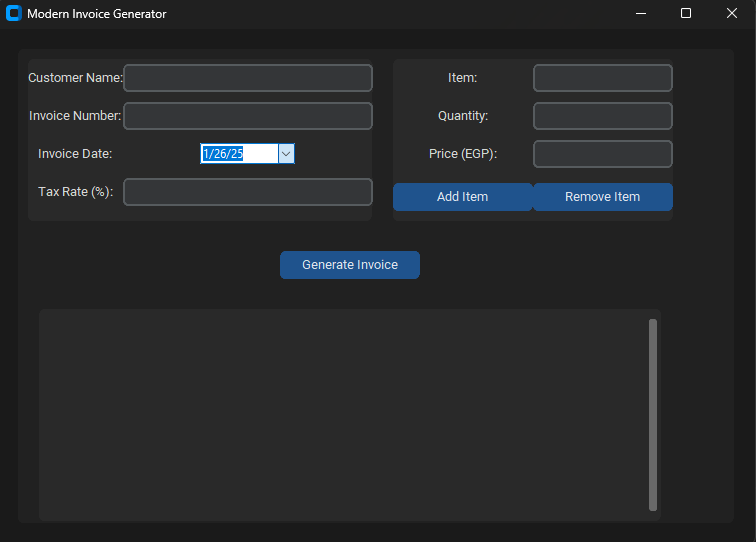

# Invoice Generator Premium

A professional desktop application for creating and managing invoices with a modern user interface. This premium version generates polished PDF invoices, supports company branding, and includes enhanced features for exporting and emailing.




---

## 🚀 Features

- **Professional Invoicing**: Create and manage invoices with a clean, intuitive interface
- **Brand Customization**: Add your company logo and details for a professional look
- **PDF Generation**: Export invoices as polished PDF documents
- **Data Export**: Save invoice data as Excel or CSV files
- **Email Integration**: Send invoices directly from the application
- **Cross-Platform**: Available for both Windows and macOS
- **User-Specific Settings**: Each user gets their own configuration
- **Clean Data Separation**: No residual data from development or testing

## 📦 Commercial Distribution

This project includes build scripts to create professional, self-contained packages for both Windows and macOS. The commercial versions store user data in the appropriate system directories and include all necessary dependencies.

### Building for Windows

1. Navigate to the `commercial_distribution` directory:
   ```powershell
   cd commercial_distribution
   ```

2. Run the build script:
   ```powershell
   powershell -ExecutionPolicy Bypass -File .\build_commercial_windows.ps1
   ```

3. Find the packaged application in `commercial_distribution/InvoiceGeneratorPremium_Windows_Commercial.zip`

### Building for macOS

1. Navigate to the `commercial_distribution` directory:
   ```bash
   cd commercial_distribution
   ```

2. Make the build script executable:
   ```bash
   chmod +x build_commercial_mac.sh
   ```

3. Run the build script:
   ```bash
   ./build_commercial_mac.sh
   ```

4. Find the packaged application in `commercial_distribution/InvoiceGeneratorPremium_macOS_Commercial.zip`

## 📝 Usage

1. **First Run**: The application will create a default configuration file in the appropriate system directory
2. **Configure Your Company**: Go to Settings and enter your company details
3. **Create Invoices**: Use the Invoice tab to create and manage your invoices
4. **Export/Email**: Save invoices as PDF or email them directly to clients

## 📦 Distribution

The commercial build scripts create self-contained packages that:
- Include all necessary dependencies
- Store user data in the correct system directories
- Are ready for immediate distribution
- Maintain a clean separation between application and user data

## 📜 License

Commercial use requires proper licensing. Please contact the developer for licensing information.

---
*Invoice Generator Premium © 2025 - Professional Edition*

## 🛠️ Development & Release

### Development Requirements
- Python 3.7+
- Required packages (see `requirements.txt`)
- PyInstaller for building distributions

### Creating a Release Package

1. Run the release script:
   ```powershell
   powershell -ExecutionPolicy Bypass -File .\create_release.ps1
   ```
2. Find the release package in the `releases` directory
3. The package includes:
   - Source code
   - Build scripts
   - Documentation
   - License information

### Versioning

Releases follow semantic versioning (MAJOR.MINOR.PATCH):
- MAJOR: Incompatible API changes
- MINOR: Backward-compatible functionality
- PATCH: Backward-compatible bug fixes

## 🚀 Usage

1. **First Run**: The application will create a default configuration file in the appropriate system directory
2. **Configure Your Company**:
   - Go to the **Settings** tab
   - Enter your company details
   - Upload your company logo (optional)
   - Configure email settings if you want to send invoices directly from the app
3. **Create Invoices**:
   - Go to the **Invoice** tab
   - Fill in customer details
   - Add line items with descriptions, quantities, and prices
   - Click "Generate PDF" to save or print the invoice
4. **Export Data**:
   - Use the export options to save invoice data as Excel or CSV
   - Email invoices directly to clients (requires SMTP configuration in Settings)

## 📦 Packaging

### Commercial Distribution

For commercial distribution, use the dedicated build scripts located in the `commercial_distribution` directory. These scripts create packages that store user configurations in the appropriate system-wide application data folders, ensuring a clean and professional user experience.

#### Windows Commercial Build

Use the PowerShell script in the `commercial_distribution` folder:

```powershell
# Navigate to the commercial distribution directory
cd commercial_distribution

# Run the build script
powershell -ExecutionPolicy Bypass -File .\build_commercial_windows.ps1
```

This will generate a zipped package named `InvoiceGeneratorPremium_Windows_Commercial.zip` containing the executable and all necessary files.

#### macOS Commercial Build

Use the shell script in the `commercial_distribution` folder:

```bash
# Navigate to the commercial distribution directory
cd commercial_distribution

# Make the script executable
chmod +x build_commercial_mac.sh

# Run the build script
./build_commercial_mac.sh
```

This will generate a zipped package named `InvoiceGeneratorPremium_macOS_Commercial.zip` containing the `.app` bundle and other files.

---

### Development Builds

You can create standalone executables for both Windows and macOS for development purposes.

You can create standalone executables for both Windows and macOS.

### Windows Build

#### Option 1: PowerShell Script (Recommended)

Use the included PowerShell script which creates a clean build with a timestamped filename:

```powershell
powershell -ExecutionPolicy Bypass -File build_premium.ps1
```

This script will:
- Create a clean build environment
- Build the executable with a unique timestamped name
- Place the final executable in the `dist_new` folder

#### Option 2: Manual PyInstaller Command

1. **Install PyInstaller**:
   ```bash
   pip install pyinstaller
   ```

2. **Run the build command**:
   ```bash
   pyinstaller --onefile --windowed --name "InvoiceGeneratorPremium" invoice.py
   ```

### macOS Build

#### Option 1: Shell Script (Recommended)

Use the included shell script to create a macOS application:

```bash
# Make the script executable
chmod +x build_mac.sh

# Run the build script
./build_mac.sh
```

This script will:
- Create a clean build environment
- Build the application with a unique timestamped name
- Place the final executable in the `dist_mac` folder

#### Option 2: Manual PyInstaller Command

1. **Install PyInstaller**:
   ```bash
   pip3 install pyinstaller
   ```

2. **Run the build command**:
   ```bash
   python3 -m PyInstaller --windowed --onefile --name "InvoiceGeneratorPremium" invoice.py
   ```

3. **Make the executable runnable**:
   ```bash
   chmod +x dist/InvoiceGeneratorPremium
   ```

### Creating a proper macOS .app bundle

For a more native macOS experience, you can convert the executable into a proper .app bundle using [Platypus](https://sveinbjorn.org/platypus):

1. **Install Platypus**:
   ```bash
   brew install platypus
   ```

2. **Create the .app bundle**:
   ```bash
   platypus -a 'Invoice Generator Premium' -o 'Text' -I 'com.digitalinsurgent.invoicegenerator' -f dist_mac/InvoiceGeneratorPremium -i app_icon.png -y dist_mac/InvoiceGeneratorPremium.app
   ```

## 📜 License

This project is licensed under the [MIT License](LICENSE).

Copyright (c) 2025 Digital Insurgent Media
Copyright (c) 2025 Khaled Mahmoud

This project is a premium white-labeled solution maintained by Digital Insurgent Media, based on the original project by Khaled Mahmoud (k5602).
